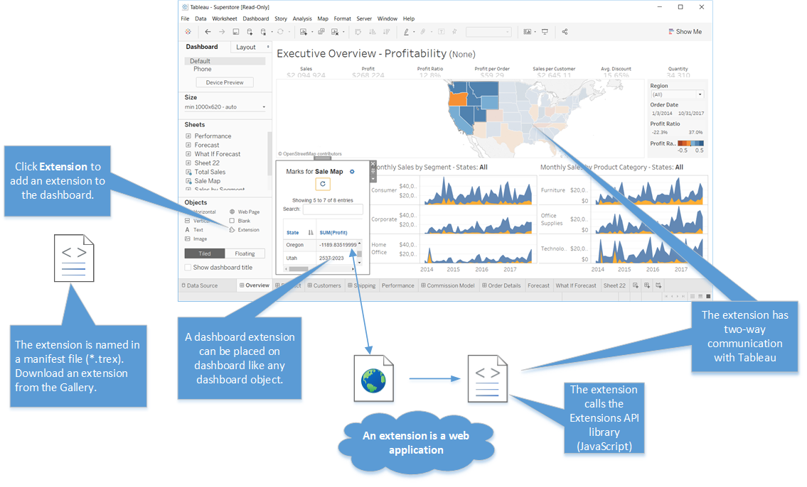
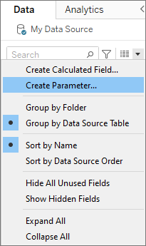
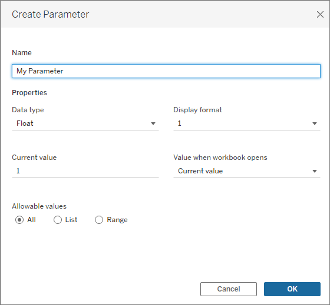
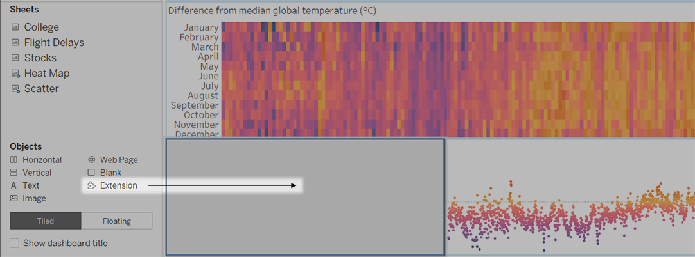

# WeLoop Tableau Server Extension

> Integrate WeLoop with Tableau Server

## Requirements

* Access to Tableau Server installation root folder
* Tableau admin access

## Overview

The extension consists of a manifest file (`.trex`), a web page that uses a Tableau-provided JavaScript library (`weloop.html`), and the JavaScript file that contain the extension logic (`weloop.js`).



| File        | Description                                                                                                                |
|-------------|----------------------------------------------------------------------------------------------------------------------------|
| WeLoop.trex | Describes the extension and identifies the location of the web application.                                                |
| weloop.html | Includes links to the Extensions API library file and to the file that contains all the JavaScript code for the extension. |
| weloop.js   | Contains code to initialize the Extensions API, and contains functions to inject the widget into the Tableau dashboard.    |

## Use locally

Due to [Same-origin policy](https://developer.mozilla.org/en-US/docs/Web/Security/Same-origin_policy), the extension files must be accessible locally.

1. Add `weloop.html`, `weloop.js` and `tableau.extensions.1.12.0.min.js` to the Tableau Server installation root folder.
2. Edit `WeLoop.trex` to replace `https://cdn.weloop.ai/tableau/weloop.html` with the URL of the local `weloop.html` file.

Your local URL might look like this:

```
http://localhost:8000/weloop.html
```

## Installation

1. Go to **Settings > Extensions**.
2. Under Dashboard and Viz Extensions, configure these options:
   * **Let users run extensions on this site**
   * **Let Sandboxed extensions run unless they are specifically blocked by a server administrator**
3. Under **Enable Specific Extensions**, add the URL of the extension. (e.g. `http://localhost:8000/weloop.html`)
4. Choose to **Allow** the extension **Full Data Access**.
5. Choose to **Hide** the **User Prompts**.

## Configuration

1. In the Data panel, click the dropdown arrow in the upper right corner and select **Create Parameter**.



2. In the Create Parameter dialog box, give the field the name **WeLoopProjectKey**.



3. Specify the data type as **String** and the current value as the WeLoop project key.

You can find the project key in the WeLoop project dashboard under **Configuration > Installation > Widget > Project key**.

## Add WeLoop to a workbook

1. In a Tableau workbook, open a dashboard sheet.
2. From the **Objects** section, drag **Extension** to the dashboard.



3. In the “Add an Extension” dialog box, click **Access Local Extensions**, and navigate to the `WeLoop.trex` file.
4. If prompted, allow dashboard extension access to data in the workbook.

## See also

* [Create Parameters](https://help.tableau.com/current/pro/desktop/en-us/parameters_create.htm)
* [Manage Dashboard and Viz Extensions in Tableau Server](https://help.tableau.com/current/server/en-us/dashboard_extensions_server.htm)
* [Add extensions to the safe list and configure user prompts](https://help.tableau.com/current/server/en-us/dashboard_extensions_server.htm#Add)
* [Get Started with Dashboard Extensions](https://tableau.github.io/extensions-api/docs/dashext/trex_getstarted)
